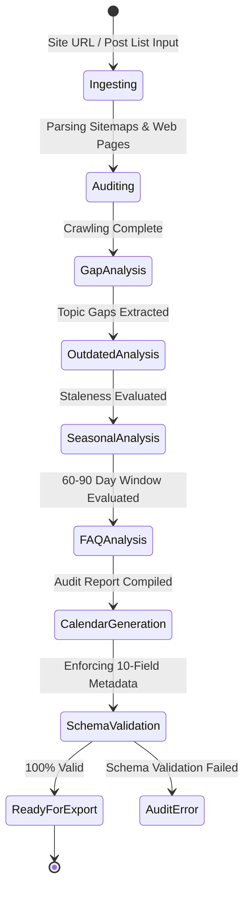

# Data Model Specification: Website Content Calendar & Audit Engine

**Feature**: Website Content Calendar & Audit Engine  
**Branch**: `001-content-calendar-audit`  
**Date**: 2026-07-21  

---

## Data Entities

### 1. `ContentCalendarItem`
Represents an individual scheduled or published blog post item in the content calendar.

| Field Name | Type | Constraints / Validation | Description |
|------------|------|--------------------------|-------------|
| `id` | `string` | UUID or slug string | Unique identifier for calendar item |
| `publishDate` | `string` | Format: `YYYY-MM-DD` | Target or actual publication date |
| `blogTitle` | `string` | Non-empty, 10–120 chars | Proposed or existing blog post headline |
| `primaryKeyword` | `string` | Non-empty | Main target SEO keyword phrase |
| `secondaryKeywords` | `string[]` | Array of strings | Comma-separated list of supporting keywords |
| `searchIntent` | `SearchIntent` | Enum: `Informational` \| `Commercial` \| `Transactional` \| `Navigational` | Primary search intent behind topic |
| `targetAudience` | `string` | Non-empty | Audience persona (e.g., "Beginner Trekkers", "Solo Travelers") |
| `contentType` | `string` | Non-empty | Format (e.g., "Trekking Itinerary", "Guide", "Comparison", "FAQ") |
| `linkToBlog` | `string` | URL or relative slug | Canonical URL for live blogs or target slug |
| `cta` | `string` | Non-empty | Actionable Call To Action statement |
| `priority` | `PriorityLevel` | Enum: `High` \| `Medium` \| `Low` | Calculated scheduling priority level |
| `sourceType` | `SourceType` | Enum: `AuditGap` \| `AuditOutdated` \| `AuditSeasonal` \| `AuditFAQ` \| `ManualPost` | Origin of the calendar recommendation |

---

### 2. `ContentAuditReport`
Comprehensive document containing the full audit results and recommendations generated for a domain or site analysis.

| Field Name | Type | Constraints / Validation | Description |
|------------|------|--------------------------|-------------|
| `auditId` | `string` | UUID | Unique audit run ID |
| `domainUrl` | `string` | Valid URL | Target website URL audited |
| `auditedAt` | `string` | ISO 8601 Timestamp | Execution date and time |
| `totalPagesIndexed` | `number` | Non-negative integer | Total pages discovered & parsed |
| `contentGaps` | `ContentGapItem[]` | Array | Identified missing topics and keyword gaps |
| `outdatedBlogs` | `OutdatedBlogItem[]` | Array | Existing posts needing SEO & content refreshes |
| `seasonalTrips` | `SeasonalTripItem[]` | Array | Time-sensitive trekking/travel opportunities |
| `faqOpportunities` | `FAQItem[]` | Array | Unaddressed user questions & FAQ targets |
| `calendar` | `ContentCalendarItem[]` | Array | Generated 10-field content calendar |

---

### 3. `ContentGapItem`

| Field Name | Type | Description |
|------------|------|-------------|
| `gapId` | `string` | Unique gap identifier |
| `topicCluster` | `string` | Category/cluster (e.g., "Himalayan Treks", "Gear Reviews") |
| `suggestedTitle` | `string` | Recommended blog headline addressing the gap |
| `primaryKeyword` | `string` | Target missing primary keyword |
| `searchIntent` | `SearchIntent` | Classification of missing intent |
| `estimatedSearchVolume` | `string` | Volume indicator (`High`, `Medium`, `Low`) |
| `priority` | `PriorityLevel` | Priority for filling this gap |

---

### 4. `OutdatedBlogItem`

| Field Name | Type | Description |
|------------|------|-------------|
| `itemId` | `string` | Unique identifier |
| `url` | `string` | Current live post URL |
| `currentTitle` | `string` | Existing post title |
| `lastUpdatedDate` | `string` | Detected publish/modified date |
| `stalenessReason` | `string` | Why flagged (e.g., "Outdated year 2023 in title", ">500 days unupdated") |
| `suggestedActions` | `string[]` | Specific recommended updates (e.g., "Update stats", "Refresh year", "Add FAQ") |
| `priority` | `PriorityLevel` | Refresh priority |

---

### 5. `SeasonalTripItem`

| Field Name | Type | Description |
|------------|------|-------------|
| `tripId` | `string` | Unique seasonal trip ID |
| `tripName` | `string` | Trekking or travel destination name (e.g., "Kedarkantha Winter Trek") |
| `peakSeasonMonths` | `string[]` | Months of peak interest (e.g., `["December", "January", "February"]`) |
| `recommendedPublishDate` | `string` | Target date (60–90 days prior to peak season start) |
| `targetAudience` | `string` | Primary traveler demographic |
| `primaryKeyword` | `string` | Seasonal search keyword |
| `priority` | `PriorityLevel` | Calculated seasonal priority |

---

### 6. `FAQItem`

| Field Name | Type | Description |
|------------|------|-------------|
| `faqId` | `string` | Unique FAQ ID |
| `question` | `string` | User question / search query |
| `suggestedAnswerOutline` | `string` | Brief answer guidance or placement context |
| `targetKeyword` | `string` | Target long-tail keyword |
| `parentBlogUrl` | `string` | Optional URL of blog to embed FAQ into |
| `priority` | `PriorityLevel` | Priority level |

---

## State Transitions & Validation Rules

### Validation Invariants
1. **10-Field Invariant**: Every `ContentCalendarItem` MUST have all 10 fields non-null and valid.
2. **Enum Invariants**:
   - `searchIntent` $\in$ `{ Informational, Commercial, Transactional, Navigational }`
   - `priority` $\in$ `{ High, Medium, Low }`
3. **Seasonal Lead-Time Invariant**: `recommendedPublishDate` for `SeasonalTripItem` MUST be scheduled between 60 and 90 days before `peakSeasonMonths[0]`.
4. **URL Lineage Invariant**: If `sourceType` == `AuditOutdated`, `linkToBlog` MUST equal the existing live article URL.
